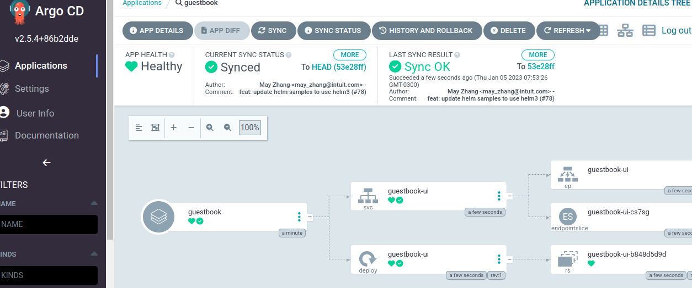

# ArgoCD PoC

Install ArgoCD on Kubernetes cluster

```
kubectl create namespace argocd
kubectl apply -n argocd -f https://raw.githubusercontent.com/argoproj/argo-cd/stable/manifests/install.yaml
```

Install ArgoCD CLI

```
sudo curl -sSL -o /usr/local/bin/argocd https://github.com/argoproj/argo-cd/releases/latest/download/argocd-linux-amd64
sudo chmod +x /usr/local/bin/argocd
argocd version
```

Generate secret and login into ArgoCD

```
kubectl -n argocd get secret argocd-initial-admin-secret -o jsonpath="{.data.password}" | base64 -d; echo
argocd login localhost:8080
```

Deploy pods on Kubernetes

```
argocd app create guestbook --repo https://github.com/argoproj/argocd-example-apps.git --path guestbook --dest-server https://kubernetes.default.svc --dest-namespace default
argocd app list
argocd app get guestbook
argocd app sync guestbook
```

Check apps using ArgoCD UI and you will see:




