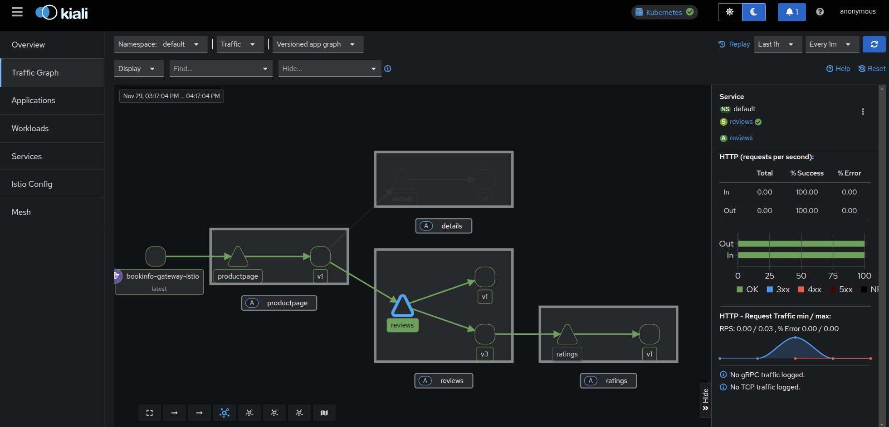

# Hello World Istio

Setup istio on cluster:

```sh
istioctl install --set profile=demo -y

istioctl apply -f https://raw.githubusercontent.com/istio/istio/release-1.28/samples/bookinfo/demo-profile-no-gateways.yaml -y

kubectl label namespace default istio-injection=enabled

kubectl get crd gateways.gateway.networking.k8s.io &> /dev/null || \
{ kubectl kustomize "github.com/kubernetes-sigs/gateway-api/config/crd?ref=v1.4.0" | kubectl apply -f -; }
```


Make accessible on browser:

```sh

kubectl apply -f https://raw.githubusercontent.com/istio/istio/release-1.28/samples/bookinfo/gateway-api/bookinfo-gateway.yaml

kubectl annotate gateway bookinfo-gateway networking.istio.io/service-type=ClusterIP --namespace=default

kubectl port-forward svc/bookinfo-gateway-istio 8081:80
```


Setup observability addons


```sh 
kubectl apply -f https://raw.githubusercontent.com/istio/istio/release-1.28/samples/addons/jaeger.yaml
kubectl apply -f https://raw.githubusercontent.com/istio/istio/release-1.28/samples/addons/prometheus.yaml
kubectl apply -f https://raw.githubusercontent.com/istio/istio/release-1.28/samples/addons/grafana.yaml
kubectl apply -f https://raw.githubusercontent.com/istio/istio/release-1.28/samples/addons/kiali.yaml
```

Accessing Kiali dashboard:

```sh
istioctl dashboard kiali
```

